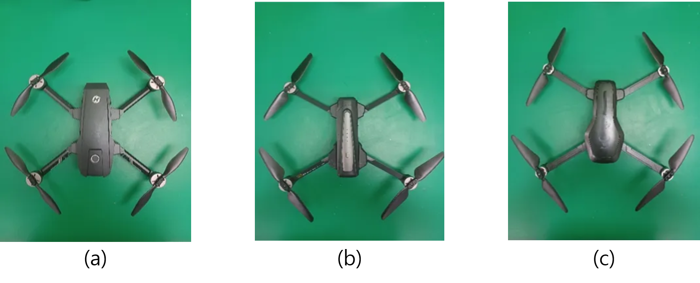
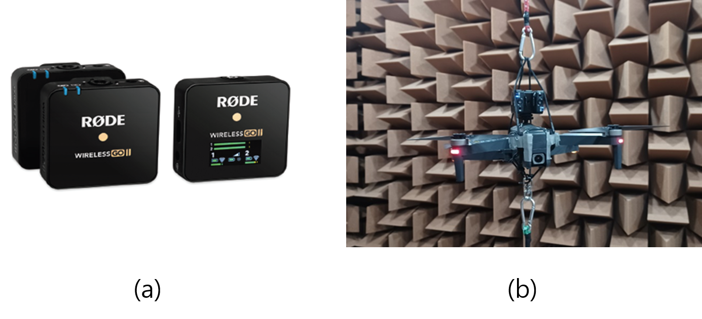
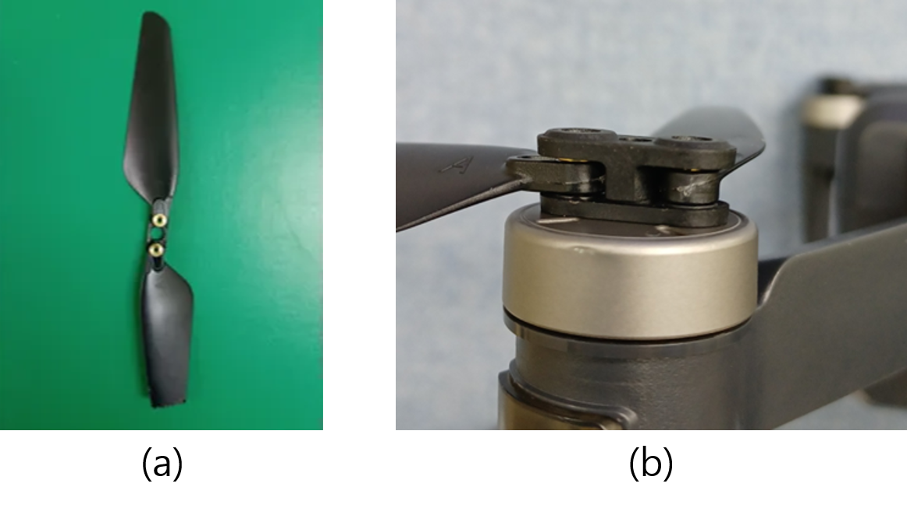
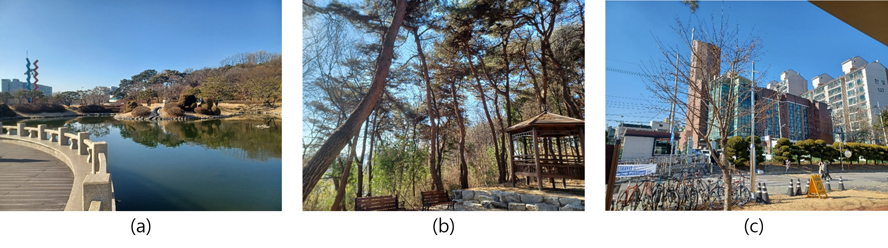
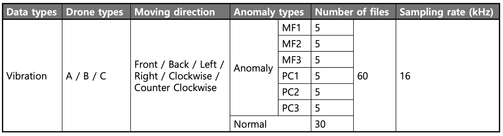
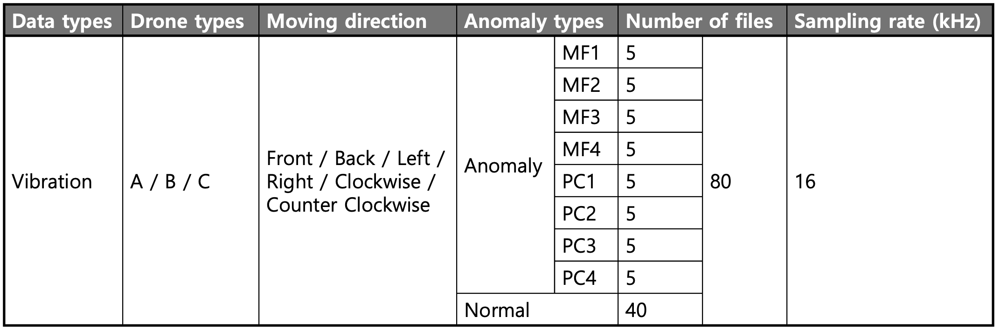
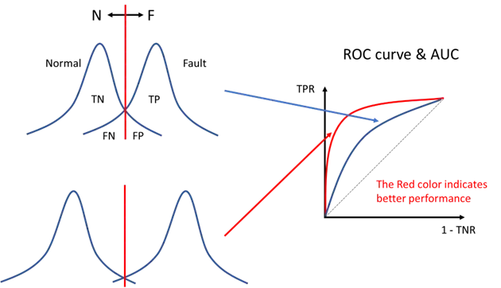

# ICSV31-AI-Challenge (2nd KSNVE AI Challenge)

This repository contains 2025 ICSV31 AI Challenge descriptions and baseline code.

## Update history

2025-02-05 23:00 (KST): Challenge Launch

## Overview
The organizing committee of the ICSV31 conference hosts an AI Challenge focusing on diagnosing machine anomalies using acoustic signals. 
Participants will train AI models on drone sound signals and identify anomalies from a provided dataset. A grand prize of 1,500 USD will be awarded to the winning team.

Participation is team-based, and _at least one team member must be a registered attendee of the ICSV31 conference_ at the time of model submission. The conference will also hold a dedicated workshop session for participating teams.

### 📢 Key dates
| Event                                                        | Date         |
| ------------------------------------------------------------ | ------------ |
| Challenge Launch (distribution of task descriptions, train & eval datasets) | 5 Feb. 2025  |
| Distribution of test dataset                                 | 1 April 2025 |
| Final submission (Anomaly score, trained model, technical report) | 21 May 2025  |
| Competition result announcement                              | 31 May 2025  |

## 1. Introduction

**2025 ICSV AI Challenge** aims to diagnose the state of drones by detecting anomalous sounds caused by mechanical failures in propellers and motors in noisy environments. In particular, drone sounds that vary depending on operational conditions, such as flight directions, along with background noise, make this task highly challenging.

The ultimate goal of the competition is to develop anomaly detection models capable of identifying anomalies in drones using data collected under various conditions.

- Participants are required to train deep learning models detecting anomalous drone sounds in test data, through the model training using the training dataset.
- Reflecting the real-world limitation of collecting a small amount of anomalous drone data, participants will tackle the challenge of training deep learning models exclusively on normal drone data. (*Self-Supervised Learning*) 
- `Train dataset` includes normal sounds from three types of quadcopter drones maneuvered in six flight directions. `Eval dataset`, which includes normal and anomalous drone sounds, is also provided for the self-evaluation of developed models. The anomalous sounds were generated from faulty drones with motor or blade tip defects.
- `Test dataset` will be released one month before the date of submission. `Test dataset` includes data for final evaluation and introduces two new types of anomalies not provided in the `eval dataset`. 
- To simulate real-world conditions, all data were augmented with environmental noise recorded in four distinct places.
- Participants must submit anomaly scores for both the `eval dataset` and `test dataset`. The organizing committee will calculate ROC-AUCs based on the submitted anomaly scores, and the weighted average of ROC-AUCs will be used to evaluate the final performance.
- The use of external datasets for model training is allowed, as long as the datasets are released to the public before 2025. 
  In this case, participants should declare which dataset was employed in the technical report.  

## 2. Dataset

Dataset for ICSV31 AI Challenge: [download](https://drive.google.com/file/d/1Lbw1mxgNWTBWjsR1IIzC97UCihdD9-bO/view?usp=sharing)

This ICSV31 AI Challenge dataset is based on the [drone noise data](https://arxiv.org/abs/2304.11708), originally constructed by Wonjun Yi, Jung-Woo Choi, Jae-Woo Lee for the drone fault classification task.  
(W. Yi, J-W. Choi., J-W. Lee, "Sound-based drone fault classification using multi-task learning", Proceedings of the 29th International Congress on Sound and Vibration (ICSV 29), Prague, Czech Republic, July. 2023.)

The previous dataset was significantly modified for this specific challenge. 

### Dataset construction
The drones used in this study include the Holy Stone HS720 **(Type A)**, MJX Bugs 12 EIS **(Type B)**, and ZLRC SG906 Pro2 **(Type C)**.

Figure 1: Three drone types used for the experiment.
(a) Type A (Holy Stone HS720), (b) Type B (MJX Bugs 12 EIS), (c) Type C (ZLRC SG960 pro2)

Drone sounds were recorded using a RØDE Wireless Go2 wireless microphone mounted on the top of the drone body. The sensitivity of the microphone was adjusted to prevent clipping even at high sound pressure levels. The recordings were conducted in an anechoic chamber to eliminate wall reflections.

Figure 2: (a) Røde Wireless Go2 microphones (transmitter, receiver), (b) recording sounds of drone type B 

The recorded drone sounds, originally sampled at 48 kHz, were downsampled to 16 kHz and segmented into 2-second segments.

- The drones were secured with two elastic ropes connected to the ceiling and floor, allowing free rotation and movement. A rotating ring was employed to minimize the impact of the ropes on the drone's motion.
- The movement direction labels include six categories: forward, backward, right, left, clockwise, and counterclockwise.

- Abnormal data were produced by incorporating defects to the drone's propeller or motor. The ***propeller defects*** were generated by cutting approximately 10% of a single propeller to generate abnormal vibrations, and ***motor defects*** were created by denting the motor cap using a vise to increase friction and hinder rotation.

 
Figure 3: Faults of drone type B. (a) propeller cut, (b) dented motor cap (red circle indicates dented part)

### Noise addition
To simulate real-flight conditions, drone sounds were mixed with background noise at a signal-to-noise ratio (SNR) of -5 to 5 dB. The background noise consists of recordings from three distinct outdoor locations (ponds, hills, and gates), as well as industrial noise from ToyADMOS Noise recorded in a real factory environment.

Figure 4: Three different spots on the university campus chosen for background noise recording: (a) pond, (b) hill, and (c) gate.

### Dataset category

Data is provided in three categories: `train` and `eval` for development, and `test` for competition submission.

> The `eval` and `test` datasets must not be directly utilized as the training data. 

- The `train` dataset consists of data from normal drones without defects.
- The `eval` dataset is provided for assessing the performance of the developed model.
- The `test` dataset, along with the `eval` dataset, is intended solely for competition submission. It should only be used to perform diagnosis of the trained model and submit the results.
- The `eval` dataset includes six types of defects: three propeller defects and three motor defects. In contrast, the `test` dataset contains a total of eight defect types, incorporating one additional propeller defect and one additional motor defect not present in the `eval` dataset.

### Dataset composition

**File Names**

**Train and Evaluation Data (5,400 train files, 1,080 eval files)**

The filenames for the `train` dataset follow the format:

**`[dataset]_[drone_type]_[moving_direction]_[anomaly_flag]_[data_index].wav`**

where:

- `[dataset]` represents the dataset type (`train` / `eval` / `test`).
- `[drone_type]` denotes the drone type (`A` / `B` / `C`).
- `[moving_direction]` indicates the movement direction (`Front` / `Back` / `Right` / `Left` / `Clockwise` / `CounterClockwise`).
- `[anomaly_flag]` specifies whether the data corresponds to a normal or anomalous drone (`normal` / `anomaly`).
- `[data_index]` is a unique identifier for the data file.

    

**Test Data (Total 1,440 files)**

The filenames for the `test` dataset follow the format:

**`[dataset]_[drone_type]_[moving_direction]_[data_index].wav`**

### Data specification

**train dataset**

- The number of files per drone type is **1,800**.
- The total number of files is **5,400**.

**evaluation dataset**

- The number of types is **60** per drone type, movement direction, and anomaly type.
- The total number of files is **60 × 3 (drone types) × 6 (movement directions) = 1,080**.
- **MF**: Motor Cap Fault
- **PC**: Propeller Cut

**test dataset**

- The number of types is **80** per drone type, movement direction, and anomaly type.
- The total number of files is **80 × 3 (drone types) × 6 (movement directions) = 1,440**.

## 3. Evaluation metrics

The evaluation metric for this challenge is **ROC-AUC (Receiver Operating Characteristic - Area Under the Curve, AU-ROC)**. ROC-AUC evaluates how well the distributions of normal and anomalous data are separated, independent of any specific decision boundary.

- **ROC-AUC** represents the relationship between the False Positive Rate (FPR) and the True Positive Rate (TPR) in the form of a curve, and the area under this curve (AUC) is used as a numerical measure of model performance.
- The ROC-AUC score ranges from **0 to 1**, where a value closer to **1** indicates that the model is highly effective at distinguishing between normal and anomalous data.
- An AUC score of **0.5** suggests that the model performs no better than random guessing in separating normal and anomalous data.

**ROC-AUC** will be calculated by the **organizing committee** using the `.csv` files submitted by participants. (Participants are not required to calculate or submit the ROC-AUC score themselves.)

## 4. Baseline systems

This challenge provides a baseline code.  
However, using or improving the baseline model is not mandatory for participation.  
Teams are free to develop their own models.

The code consists of three files:

- **`train.py`**: Trains a deep learning model using the train dataset.
- **`eval.py`**: Evaluates the model performance using the validation dataset.
- **`test.py`**: Extracts anomaly scores for the test dataset.

#### Model architecture

The baseline model utilizes **WaveNet** to perform a prediction task on spectrograms.  
WaveNet is primarily used as an audio generation model for anomalous sound detection. Due to its exponentially increasing dilation rate in each residual block, WaveNet has a wide receptive field.  

In the baseline model, WaveNet performs causal convolution to predict future spectral frames in the spectrogram.  
The model trained to minimize the prediction error of normal data tends to produce significantly higher prediction errors on anomalous data. This characteristic is leveraged for anomaly detection.

#### Anomaly score

The **anomaly score** is computed using the mean squared error (MSE) between the target and predicted spectrograms.

Let the input spectrogram be $\mathbf{X} = [\mathbf{x}\_1, \dots , \mathbf{x}\_T] \in R^{F \times T},$ where $F$ and $T$ represent the **frequency** and **time** dimensions of the spectrogram, respectively.
The model takes input data of length equal to the receptive field, $[\mathbf{x}\_{1},~ \cdots,~ \mathbf{x}\_{l}]$, and predicts the next spectral frame $\hat{\mathbf{x}}\_{l+1}$. This is formulated as:
$\hat{\mathbf{x}}\_{t+1} = \psi\_{\phi}(\mathbf{x}\_{t-l+1}, \cdots, \mathbf{x}\_{t}).$
Given the input data $\mathbf{X} = [\mathbf{x}\_1, \dots , \mathbf{x}\_T],$ the model predicts $\hat{\mathbf{X}} = [\hat{\mathbf{x}}\_{l+1}, \dots, \hat{\mathbf{x}}\_{T+1}]$.
The **anomaly score** for each data point is computed as:
$\text{Score} = \frac{1}{T-l} \sum_{t=l+1}^{T} \|\mathbf{x}\_t - \hat{\mathbf{x}}\_t \|^2$, where the mean squared error (MSE) measures the deviation between the actual and predicted spectrogram frames.

#### Performance of baseline model

The **baseline model** was trained for **100 epochs** with a **learning rate of 1e-3** and a **batch size of 64**.  

The anomaly detection performance of the baseline model on the evaluation dataset is as follows:

|Drone | A    | B | C |
|----|----------|----------|----------|
|AUC (%)| 69.62   | 74.88   | 67.41   |

## 5. Submission
Please submit your files to [Submission link](https://docs.google.com/forms/d/e/1FAIpQLSdEnCw_p9yT6ONhb3zgaesTu2ZxtcYCIuEksVaZzMCmhUVoCw/viewform)

Participants must submit **four files** for challenge participation:

1. **Evaluation dataset performance** (`eval_score.csv`)
2. **Test dataset performance** (`test_score.csv`)
3. **Reproducible training and evaluation code** (`.zip`)
4. **Technical report** (`.pdf`)

The `eval.py` and `test.py` files generate and save the **anomaly scores** for the evaluation and test datasets as `eval_score.csv` and `test_score.csv`, respectively.  
The **organizers** will use these files to compare the performance of participants' models.

Participants must submit code that can **reproduce the model’s performance**. This process is intended to verify the reproducibility of the submitted code and will not be used for any other purpose. The copyright of the code fully belongs to the author. 
The trained model file should be included in a compressed **zip file**, which must contain all necessary components to generate `eval_score.csv` and `test_score.csv`.

The **technical report** should describe:

- The proposed anomaly detection model architecture
- The model training process
- The anomaly detection methodology

The technical report must be formatted according to the ICSV paper guideline [link](https://icsv31.org/index.php?va=viewpage&vaid=247). 
All reports submitted to the challenge will be included in the conference proceeding as `non-referred papers`. 
Participants do not need to submit the report through the ICSV website separately. 

## Organizers
This challenge is hosted by the KSNVE (Korean Society of Noise and Vibration Engineering). For inquiries, please send an email to [Organizing Committee.](mailto:icsv31aichallenge@gmail.com)

- Challenge organizers

  - 📧 **Jung-Woo Choi (KAIST, School of Electrical Engineering)** 
  - 📧 **Jihoon Choi (KAIST, School of Electrical Engineering)** 
  - 📧 **Seojin Park (KAIST, School of Electrical Engineering)** 
  - 📧 **Yewon Kim (KAIST, School of Electrical Engineering)** 

We look forward to your participation and are happy to assist with any questions!
